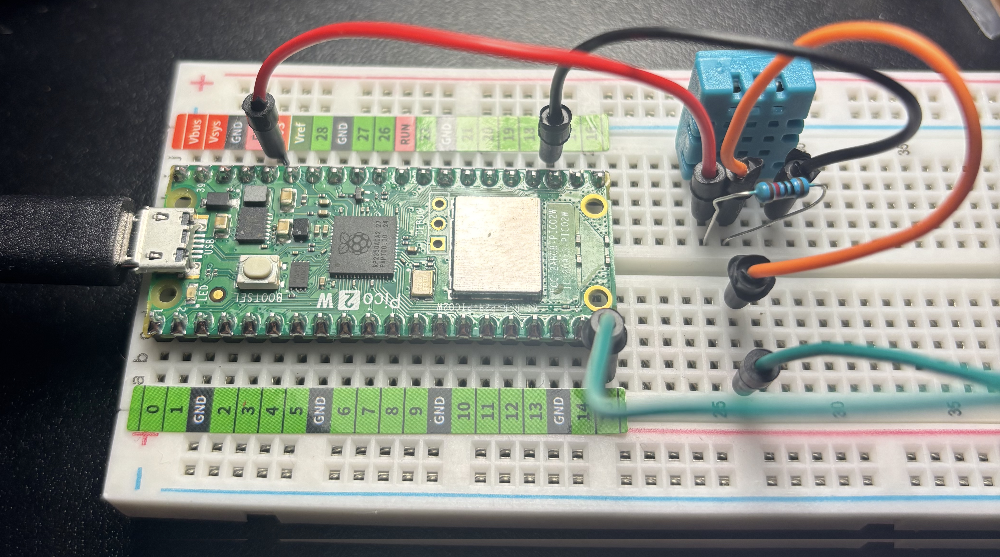

# DHT11 + Raspberry Pi Pico 2 W

Small embedded Rust exercise using a bare 4-pin DHT11 temperature and humidity sensor with a Raspberry Pi Pico 2 W.



## Wiring

DHT11 front view, pins from left to right:

1. VCC
2. DATA
3. NC
4. GND

Connections:

- Pico `3V3` -> DHT11 pin 1 (`VCC`)
- Pico `GP15` -> DHT11 pin 2 (`DATA`)
- DHT11 pin 3 -> not connected
- Pico `GND` -> DHT11 pin 4 (`GND`)
- `10 kΩ` pull-up resistor between DHT11 pin 1 (`VCC`) and pin 2 (`DATA`)

```text
               3V3
                |
                +-----------> pin 1 VCC
                |
              [10 kΩ]
                |
GP15 -----------------------> pin 2 DATA

                              pin 3 NC

GND ------------------------> pin 4 GND
```

```
┌────────────────────────────────────┐
│ Embassy executor                   │
│                                    │
│   sensor_task()       usb_task()   │
│        │                  │        │
└────────┼──────────────────┼────────┘
         │                  │
         ▼                  ▼
     Dht11Driver        USB CDC
         │
    ┌────┴─────┐
    │          │
   GP15      TIMER0
```


```
$ picotool uf2 convert target/thumbv8m.main-none-eabihf/release/steren-dht11 -t elf firmware.uf2
```